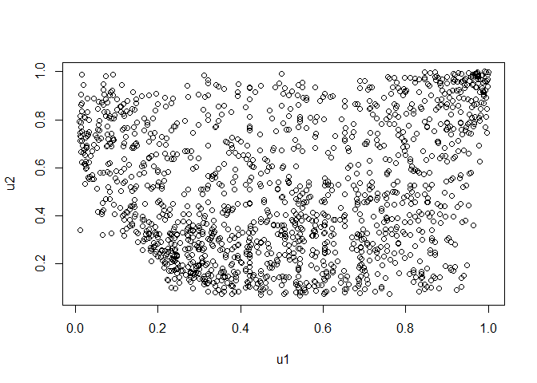

R package for a new beta-type copula: rMGLReg
================
Zhengxiao Li

-   [Installation](#installation)
-   [Example](#example)
    -   [Simuation from the MGL and survival
        copulas](#simuation-from-the-mgl-and-survival-copulas)
    -   [Plots of survival MGL-EV
        copula](#plots-of-survival-mgl-ev-copula)

<!-- README.md is generated from README.Rmd. Please edit that file -->
<!-- # rMGLReg -->
<!-- badges: start -->
<!-- badges: end -->

The goal of `rMGLReg` is to

-   provide a nice visualization tool for interpreting the MGL copula
    and MGL-EV copula, along with its survival copulas.

-   show the maximum likelihood (ME) estimation method for the copula
    regression models with/without covariates.

## Installation

-   You can install the released version of `rMGLReg` by running the
    following lines in R software:

``` r
install.packages("devtools")
library(devtools)
devtools::install_github("lizhengxiao/rMGLReg")
```

-   To access documentation for all the functions present in the
    package; for example, enter the command:

``` r
library(rMGLReg)
help(package = rMGLReg)
```

-   You can see all the installed vignettes in `rMGLReg` package with

``` r
browseVignettes(package  = "rMGLReg")
```

## Example

### Simuation from the MGL and survival copulas

-   This is a basic example which shows the normalized scatter plots for
    (*δ* = 1.2) with simulated samples of the 3-dimensional MGL copula
    and survival MGL copula.

``` r
library(rMGLReg)
## basic example code
set.seed(271)
n <- 1000
delta <- 1.2
d <- 3
U <- rcMGL.multi(n = 1000, d = d, pars = delta)
cor(U, method = "kendall")
#>           [,1]      [,2]      [,3]
#> [1,] 1.0000000 0.2322282 0.2335576
#> [2,] 0.2322282 1.0000000 0.2138058
#> [3,] 0.2335576 0.2138058 1.0000000
par(pty = "s")
pairs(U, gap = 0, cex = 0.5)
```


``` r
set.seed(271)
n <- 1000
delta <- 1.2
d <- 3
U <- rcMGL180.multi(n = 1000, d = d, pars = delta)
cor(U, method = "kendall")
#>           [,1]      [,2]      [,3]
#> [1,] 1.0000000 0.2322282 0.2335576
#> [2,] 0.2322282 1.0000000 0.2138058
#> [3,] 0.2335576 0.2138058 1.0000000
par(pty = "s")
pairs(U, gap = 0, cex = 0.5)
```


### Plots of survival MGL-EV copula

``` r
library(data.table)
library(ggplot2)
library(latex2exp)
library(metR)
# joint distribution function of survival MGL-EV copula
n.grid <- 200
par.copula <- 1
xgrid <- ygrid <- seq(0.01, 0.99, length.out = n.grid)
grid <- expand.grid("u1" = xgrid, "u2" = ygrid)
mtrx3d <- matrix(0, nrow = nrow(grid), ncol = 3)
mtrx3d <- cbind(grid, 
                "pcu1u2" = pcMGLEV.bivar(u1 = grid[,1], 
                                   u2 = grid[,2], 
                                   param = par.copula)) # evaluate W on 'grid'

mtrx3d <- data.table(u1 = mtrx3d[,1], 
                     u2 = mtrx3d[,2], 
                     pcu1u2 = mtrx3d[,3])

p1 <- ggplot(mtrx3d, aes(u1, u2, z = pcu1u2)) + 
  scale_x_continuous(expand = c(0, 0), limits = c(0, 1)) + 
  scale_y_continuous(expand = c(0, 0), limits = c(0, 1)) + 
  theme_bw() + 
  ggtitle(TeX('Contour plot for cdf of $\\bar{C}^{MGL-EV}$')) + 
  theme(axis.line = element_line(colour = "black"),
        axis.text.x = element_text(margin = margin(t = 0.25, unit = "cm")),
        axis.text.y = element_text(margin = margin(r = 0.25, unit = "cm"),
                                   size = 10, 
                                   vjust = 0.5, 
                                   hjust = 0.5),
        plot.title = element_text(hjust = 0.5)) + 
  labs(x = TeX("$u_1$"), y = TeX("$u_2$"))  + 
  geom_contour(colour = 'black', 
               show.legend = TRUE,
               bins = 10,
               size = 0.8
  ) + 
  geom_text_contour(aes(z = round(pcu1u2, 4)), stroke = 0.2)


# joint density function of survival MGL-EV copula
n.grid <- 200
par.copula <- 1
xgrid <- ygrid <- seq(0.05, 0.95, length.out = n.grid)
grid <- expand.grid("u1" = xgrid, "u2" = ygrid)
mtrx3d <- matrix(0, nrow = nrow(grid), ncol = 3)
mtrx3d <- cbind(grid, 
                "dcu1u2" = dcMGLEV.bivar(u1 = grid[,1], 
                                   u2 = grid[,2], 
                                   param = par.copula)) # evaluate W on 'grid'
head(mtrx3d)
#>           u1   u2   dcu1u2
#> 1 0.05000000 0.05 3.843447
#> 2 0.05452261 0.05 3.702302
#> 3 0.05904523 0.05 3.566294
#> 4 0.06356784 0.05 3.436053
#> 5 0.06809045 0.05 3.311850
#> 6 0.07261307 0.05 3.193728
mtrx3d <- data.table(u1 = mtrx3d[,1], 
                     u2 = mtrx3d[,2], 
                     dcu1u2 = mtrx3d[,3])

library(ggplot2)
library(reshape2)
#> 
#> 载入程辑包：'reshape2'
#> The following objects are masked from 'package:data.table':
#> 
#>     dcast, melt
library(metR)
p2 <- ggplot(mtrx3d, aes(u1, u2, z = dcu1u2)) + 
  scale_x_continuous(expand = c(0, 0), limits = c(0, 1)) + 
  scale_y_continuous(expand = c(0, 0), limits = c(0, 1)) + 
  theme_bw() + 
  ggtitle(TeX('Contour plot for pdf of $\\bar{C}^{MGL-EV}$')) + 
  theme(axis.line = element_line(colour = "black"),
        axis.text.x = element_text(margin = margin(t = 0.25, unit = "cm")),
        axis.text.y = element_text(margin = margin(r = 0.25, unit = "cm"),
                                   size = 10, 
                                   vjust = 0.5, 
                                   hjust = 0.5),

        plot.title = element_text(hjust = 0.5)) + 
  labs(x = TeX("$u_1$"), y = TeX("$u_2$"))  + 
  geom_contour(colour = 'black', 
               show.legend = TRUE,
               bins = 15, 
               size = 0.8, 
               linetype = 1
               ) + 
  geom_text_contour(aes(z = round(dcu1u2, 4)), stroke = 0.2)


# the Pickands dependence function of survival MGL-EV copula
delta.vector <- c(0.01, 0.6, 1.5, 2.0, 20)
k.mat <- matrix(0, nrow = 100, ncol = length(delta.vector))
for(i in 1:length(delta.vector)){
  w.vector <- seq(0.0001, 0.9999, length.out = 100)
  k.mat[,i] <- Afunction(w = w.vector, param = delta.vector[i])
}

dtplot <- data.table(w = rep(w.vector, times = length(delta.vector)),
                     delta = factor(rep(delta.vector, each = 100)),
                     k = as.vector(k.mat))
p3 <- ggplot(data = dtplot, 
       mapping = aes(x = w, y = k)) + 
  theme_bw() + xlab(TeX('$w$')) + ylab(TeX('$A(w)$')) + 
  geom_line(aes(linetype = delta), size = 0.8) +
  scale_x_continuous(limits = c(0, 1),
                     breaks = seq(0, 1, by = 0.2)) +
  scale_y_continuous(limits = c(0.5, 1),
                     breaks = seq(0.5, 1, by = 0.1)) +
  ggtitle(TeX('Pickands functions of $\\bar{C}^{MGL-EV}$')) + 
  theme(axis.line = element_line(colour = "black"),
        axis.text.x = element_text(margin = margin(t = 0.25, unit = "cm")),
        axis.text.y = element_text(margin = margin(r = 0.25, unit = "cm"),
                                   size = 10,
                                   vjust = 0.5,
                                   hjust = 0.5),
        axis.ticks.length = unit(-0.1, "cm"),
        plot.title = element_text(hjust = 0.5),
        legend.direction = 'vertical',
        legend.box.just = "right",
        legend.text = element_text(size = 10)
  ) + labs(linetype = TeX('$\\delta$'))
```

``` r
library(patchwork)
p0 <- p1 + p2 + p3 + plot_layout(ncol = 3)
p0
```


