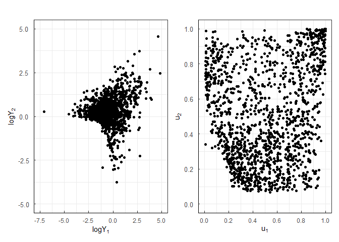

-   [rMGLReg](#rmglreg)
    -   [Installation](#installation)
    -   [Example](#example)
        -   [Simuation from the proposed
            copulas](#simuation-from-the-proposed-copulas)
        -   [Plots of survival MGL-EV
            copula](#plots-of-survival-mgl-ev-copula)
        -   [*d* = 10-dimensional MGL regression
            model](#d10-dimensional-mgl-regression-model)
        -   [Case I - Danish fire data
            set](#case-i---danish-fire-data-set)

<!-- README.md is generated from README.Rmd. Please edit that file -->

# rMGLReg

<!-- badges: start -->
<!-- badges: end -->

The goal of rMGLReg is to

-   provide a nice visualization tool for interpreting the MGL copula
    and MGL-EV copula, along with its survival copulas.

-   show the maximum likelihood (ME) estimation method for the copula
    regression models with/without covariates.

## Installation

You can install the released version of rMGLReg by running the following
lines in R software:

``` r
install.packages("devtools")
library(devtools)
devtools::install_github("lizhengxiao/rMGLReg")
```

## Example

### Simuation from the proposed copulas

This is a basic example which shows the normalized scatter plots for
(*δ* = 1.2) with simulated samples of the 3-dimensional MGL copula and
survival MGL copula.

``` r
library(rMGLReg)
## basic example code
set.seed(271)
n <- 1000
delta <- 1.2
d <- 3
U <- rcMGL.multi(n = 1000, d = d, pars = delta)
cor(U, method = "kendall")
#>           [,1]      [,2]      [,3]
#> [1,] 1.0000000 0.2322282 0.2335576
#> [2,] 0.2322282 1.0000000 0.2138058
#> [3,] 0.2335576 0.2138058 1.0000000
par(pty = "s")
pairs(U, gap = 0, cex = 0.5)
```


``` r
set.seed(271)
n <- 1000
delta <- 1.2
d <- 3
U <- rcMGL180.multi(n = 1000, d = d, pars = delta)
cor(U, method = "kendall")
#>           [,1]      [,2]      [,3]
#> [1,] 1.0000000 0.2322282 0.2335576
#> [2,] 0.2322282 1.0000000 0.2138058
#> [3,] 0.2335576 0.2138058 1.0000000
par(pty = "s")
pairs(U, gap = 0, cex = 0.5)
```


### Plots of survival MGL-EV copula

``` r
library(data.table)
library(ggplot2)
library(latex2exp)
library(metR)
# joint distribution function of survival MGL-EV copula
n.grid <- 200
par.copula <- 1
xgrid <- ygrid <- seq(0.01, 0.99, length.out = n.grid)
grid <- expand.grid("u1" = xgrid, "u2" = ygrid)
mtrx3d <- matrix(0, nrow = nrow(grid), ncol = 3)
mtrx3d <- cbind(grid, 
                "pcu1u2" = pcMGLEV.bivar(u1 = grid[,1], 
                                   u2 = grid[,2], 
                                   param = par.copula)) # evaluate W on 'grid'
mtrx3d <- data.table(u1 = mtrx3d[,1], 
                     u2 = mtrx3d[,2], 
                     pcu1u2 = mtrx3d[,3])
p1 <- ggplot(mtrx3d, aes(u1, u2, z = pcu1u2)) + 
  scale_x_continuous(expand = c(0, 0), limits = c(0, 1)) + 
  scale_y_continuous(expand = c(0, 0), limits = c(0, 1)) + 
  theme_bw() + 
  ggtitle(TeX('Contour plot for cdf of $\\bar{C}^{MGL-EV}$')) + 
  theme(axis.line = element_line(colour = "black"),
        axis.text.x = element_text(margin = margin(t = 0.25, unit = "cm")),
        axis.text.y = element_text(margin = margin(r = 0.25, unit = "cm"),
                                   size = 10, 
                                   vjust = 0.5, 
                                   hjust = 0.5),
        plot.title = element_text(hjust = 0.5)) + 
  labs(x = TeX("$u_1$"), y = TeX("$u_2$"))  + 
  geom_contour(colour = 'black', 
               show.legend = TRUE,
               bins = 10,
               size = 0.8
  ) + 
  geom_text_contour(aes(z = round(pcu1u2, 4)), stroke = 0.2)
# joint density function of survival MGL-EV copula
n.grid <- 200
par.copula <- 1
xgrid <- ygrid <- seq(0.05, 0.95, length.out = n.grid)
grid <- expand.grid("u1" = xgrid, "u2" = ygrid)
mtrx3d <- matrix(0, nrow = nrow(grid), ncol = 3)
mtrx3d <- cbind(grid, 
                "dcu1u2" = dcMGLEV.bivar(u1 = grid[,1], 
                                   u2 = grid[,2], 
                                   param = par.copula)) # evaluate W on 'grid'
head(mtrx3d)
#>           u1   u2   dcu1u2
#> 1 0.05000000 0.05 3.843447
#> 2 0.05452261 0.05 3.702302
#> 3 0.05904523 0.05 3.566294
#> 4 0.06356784 0.05 3.436053
#> 5 0.06809045 0.05 3.311850
#> 6 0.07261307 0.05 3.193728
mtrx3d <- data.table(u1 = mtrx3d[,1], 
                     u2 = mtrx3d[,2], 
                     dcu1u2 = mtrx3d[,3])
library(ggplot2)
library(reshape2)
#> 
#> 载入程辑包：'reshape2'
#> The following objects are masked from 'package:data.table':
#> 
#>     dcast, melt
library(metR)
p2 <- ggplot(mtrx3d, aes(u1, u2, z = dcu1u2)) + 
  scale_x_continuous(expand = c(0, 0), limits = c(0, 1)) + 
  scale_y_continuous(expand = c(0, 0), limits = c(0, 1)) + 
  theme_bw() + 
  ggtitle(TeX('Contour plot for pdf of $\\bar{C}^{MGL-EV}$')) + 
  theme(axis.line = element_line(colour = "black"),
        axis.text.x = element_text(margin = margin(t = 0.25, unit = "cm")),
        axis.text.y = element_text(margin = margin(r = 0.25, unit = "cm"),
                                   size = 10, 
                                   vjust = 0.5, 
                                   hjust = 0.5),
        plot.title = element_text(hjust = 0.5)) + 
  labs(x = TeX("$u_1$"), y = TeX("$u_2$"))  + 
  geom_contour(colour = 'black', 
               show.legend = TRUE,
               bins = 15, 
               size = 0.8, 
               linetype = 1
               ) + 
  geom_text_contour(aes(z = round(dcu1u2, 4)), stroke = 0.2)
# the Pickands dependence function of survival MGL-EV copula
delta.vector <- c(0.01, 0.6, 1.5, 2.0, 20)
k.mat <- matrix(0, nrow = 100, ncol = length(delta.vector))
for(i in 1:length(delta.vector)){
  w.vector <- seq(0.0001, 0.9999, length.out = 100)
  k.mat[,i] <- Afunction(w = w.vector, param = delta.vector[i])
}
dtplot <- data.table(w = rep(w.vector, times = length(delta.vector)),
                     delta = factor(rep(delta.vector, each = 100)),
                     k = as.vector(k.mat))
p3 <- ggplot(data = dtplot, 
       mapping = aes(x = w, y = k)) + 
  theme_bw() + xlab(TeX('$w$')) + ylab(TeX('$A(w)$')) + 
  geom_line(aes(linetype = delta), size = 0.8) +
  scale_x_continuous(limits = c(0, 1),
                     breaks = seq(0, 1, by = 0.2)) +
  scale_y_continuous(limits = c(0.5, 1),
                     breaks = seq(0.5, 1, by = 0.1)) +
  ggtitle(TeX('Pickands functions of $\\bar{C}^{MGL-EV}$')) + 
  theme(axis.line = element_line(colour = "black"),
        axis.text.x = element_text(margin = margin(t = 0.25, unit = "cm")),
        axis.text.y = element_text(margin = margin(r = 0.25, unit = "cm"),
                                   size = 10,
                                   vjust = 0.5,
                                   hjust = 0.5),
        axis.ticks.length = unit(-0.1, "cm"),
        plot.title = element_text(hjust = 0.5),
        legend.direction = 'vertical',
        legend.box.just = "right",
        legend.text = element_text(size = 10)
  ) + labs(linetype = TeX('$\\delta$'))
```

``` r
library(patchwork)
p0 <- p1 + p2 + p3 + plot_layout(ncol = 3)
p0
```


### *d* = 10-dimensional MGL regression model

``` r
# simulated data
set.seed(111)
Nsim <- 1000
d <- 10
n <- 1000 # sample size
beta.true <- c(-0.6, 0.5, 0.2) # true regression coefficients
x1 <- rnorm(n, 0, 1)
x2 <- rnorm(n, 0, 1)
X <- model.matrix(~ x1 + x2) # design matrix
delta.sim <- as.vector(exp(X%*%beta.true)) # true copula parameters
Usim <- matrix(0, nrow = n, ncol = d)
for (i in 1:n){
  Usim[i, ] <- rcMGL.multi(n = 1, d = d, pars = delta.sim[i])
}
m.MGLMGA <- MGL.reg(U = Usim, copula = "MGL",
                                 X = X, method = "Nelder-Mead",
                                 initpar = c(-0.32, 0.001, 0.001)
  )
m.MGLMGA
#> $loglike
#> [1] 729.0535
#> 
#> $copula
#> $copula$name
#> [1] "MGL"
#> 
#> 
#> $estimates
#> [1] -0.6091929  0.4555460  0.1676800
#> 
#> $se
#> [1] 0.03939535 0.03466884 0.03400156
#> 
#> $hessian
#>           [,1]       [,2]      [,3]
#> [1,] -913.5135  -544.5927 -119.1106
#> [2,] -544.5927 -1159.3980  -22.2301
#> [3,] -119.1106   -22.2301 -883.3534
#> 
#> $AIC
#> [1] -1452.107
#> 
#> $BIC
#> [1] -1437.384
```

### Case I - Danish fire data set

-   As the first example, we fit the bivariate copula and regression
    models to the Danish fire insurance data set which was collected
    from the Copenhagen Reinsurance Company and comprises 2167 fire
    losses over the period 1980-1990.

``` r
  library(rMGLReg)
  library(fitdistrplus)
#> Warning: 程辑包'fitdistrplus'是用R版本4.1.2 来建造的
#> 载入需要的程辑包：MASS
#> 
#> 载入程辑包：'MASS'
#> The following object is masked from 'package:patchwork':
#> 
#>     area
#> 载入需要的程辑包：survival
#> Warning: 程辑包'survival'是用R版本4.1.2 来建造的
  library(splines)
  library(snpar)
  data("danishmulti")
  dt <- data.table::data.table(danishmulti)
  dtnew <- dt[Building>0&Contents>0]
  y1 <- dtnew$Building
  y2 <- dtnew$Contents
  y <- cbind(y1, y2)
  
  # empirical cdf
  u1 <- snpar::kde(y[,1], kernel = "gaus", 
             xgrid = y[,1],
             h = 0.2)$Fhat
  u2 <- snpar::kde(y[,2], kernel = "gaus", 
             xgrid = y[,2],
             h = 0.2)$Fhat
  U <- cbind(u1, u2) # bivariate pseudo copula data.
```

``` r
library(ggplot2)
library(latex2exp)
Usample <- U
XY <- y
newtheme <-   theme_bw() + theme(axis.line = element_line(colour = "black"),
                                 axis.text.x = element_text(margin = margin(t = 0.25, unit = "cm")),
                                 axis.text.y = element_text(margin = margin(r = 0.25, unit = "cm"),
                                                            size = 10, 
                                                            vjust = 0.5, 
                                                            hjust = 0.5),
                                 axis.ticks.length = unit(-0.1, "cm"),
                                 plot.title = element_text(hjust = 0.5),
                                 legend.direction = 'vertical',
                                 legend.position = c(.95, .99),
                                 legend.justification = c("right", "top"),
                                 legend.box.just = "right",
                                 legend.text = element_text(size = 10)) 

dtplot <- data.frame(U1 = Usample[,1], U2 = Usample[,2],
                     logY1 = log(XY[,1]), logY2 = log(XY[,2]))

p1 <- ggplot(data = dtplot, mapping = aes(y = logY1, 
                                          x = logY2)) + 
  newtheme +
  geom_point() + 
  labs(title = "", 
       x = TeX("$log Y_1$"), 
       y = TeX("$log Y_2$")) +  
  scale_x_continuous(limits = c(-7.5, 5),
                     breaks = seq(-7.5, 5, by = 2.5)) +
  scale_y_continuous(limits = c(-5, 5),
                     breaks = seq(-5, 5, by = 2.5))


p2 <- ggplot(data = dtplot, mapping = aes(y = U2, 
                                           x = U1)) + 
  newtheme +
  geom_point() + 
  labs(title = "", 
     x = TeX("$u_1$"), 
     y = TeX("$u_2$")) +  
  scale_x_continuous(limits = c(0, 1),
                     breaks = seq(0, 1, by = 0.2)) +
  scale_y_continuous(limits = c(0, 1),
                     breaks = seq(0, 1, by = 0.2))


library(patchwork)
p0 <- p1 + p2 + plot_layout(ncol = 2)
p0
```



-   This table reports the estimation results, AIC and BIC values of the
    survival MGL and the survival MGL-EV copula, along with four other
    families of copulas with positive upper tail indices, the MGB2
    copula, the Gumbel copula, the Student *t* copula, and the Gaussian
    copula.

``` r
m.norm <- MGL.mle(U = U,
                        copula  = "Normal",
                        initpar = 0.5)

m.t <- MGL.mle(U = U,
                     copula  = "t",
                     initpar = c(0.5, 4))
m.gumbel <- MGL.mle(U = U,
                     copula  = "Gumbel",
                          initpar = c(2))
m.MGLMGA180 <- MGL.mle(U,
                    copula  = "MGL180",
                             initpar = c(1))
m.MGB2 <- MGL.mle(U,
                      copula  = "MGB2",
                        initpar = c(0.1, 2, 0.4))

m.MGLEV180 <- MGL.mle(U,
                         copula  = "MGL-EV180",
                         initpar = c(2))

recap <- function(x){
  res <- c(alpha = x$estimates,
           se = x$se,
           loglike = x$loglike,
           AIC = x$AIC, BIC = x$BIC)
  if(length(res) < 6)
    res <- c(res[1], NA, NA,res[2], NA, NA, res[3:5])
  if (length(res) > 6 & length(res) < 9)
    res <- c(res[1:2], NA, res[3:4], NA, res[5:7])
  res <- as.matrix(res)
  colnames(res) <- x$copula$name
  res}
res.all <- round(cbind(recap(m.norm),
                       recap(m.t),
                       recap(m.gumbel),
                       recap(m.MGLMGA180),
                       recap(m.MGB2),
                       recap(m.MGLEV180)
), 4)
out.com <- t(res.all)
out.com <- out.com[order(out.com[,9], decreasing = T),]
knitr::kable(out.com, digits = 3)
```

|           | alpha |       |       |    se |       |       | loglike |      AIC |      BIC |
|:----------|------:|------:|------:|------:|------:|------:|--------:|---------:|---------:|
| Gaussian  | 0.252 |    NA |    NA | 0.027 |    NA |    NA |  35.602 |  -69.205 |  -63.890 |
| Student   | 0.193 | 3.400 |    NA | 0.032 | 0.457 |    NA |  64.084 | -124.168 | -113.539 |
| Gumbel    | 1.211 |    NA |    NA | 0.022 |    NA |    NA |  79.127 | -156.255 | -150.940 |
| MGL-EV180 | 0.655 |    NA |    NA | 0.040 |    NA |    NA |  81.760 | -161.519 | -156.204 |
| MGL180    | 0.892 |    NA |    NA | 0.067 |    NA |    NA | 115.967 | -229.935 | -224.620 |
| MGB2      | 0.233 | 1.123 | 0.939 | 0.046 | 0.561 | 0.209 | 127.819 | -249.638 | -233.694 |

-   We further investigate the dynamic dependence introducing the
    covariate into the dependence parameter in the survival MGL and
    survival MGL-EV regression model respectively.

``` r
  dtnew[, year := as.numeric(substr(Date, start = 1, stop = 4))]
  dtnew[, x1 := (year - mean(year))/(sd(year))]
  dtnew[, day := difftime(as.Date(Date), as.Date("1980-01-03"), units="days")]

  X <- splines::ns(dtnew$year, knots = quantile(dtnew$year, c(0.5)), intercept = T)

  
  m.MGL180 <- MGL.reg(U = U, copula = "MGL180",
                                 X = X, method = "Nelder-Mead",
                                 initpar = c(-0.32, 0.001, 0.001)
  )
  # survival MGL-EV copual regression
  m.MGLEV180 <- MGL.reg(U = U, copula = "MGL-EV180",
                         method = "Nelder-Mead",
                         X = X,
                         initpar = c(-0.32, 0.001, 0.001)
  )
  
  
  
```

-   The predicted value of copula parameter with different value of the
    covariate for the Danish fire insurance data set.

``` r
# Survival MGL regression model
par.est <- m.MGL180$estimates
agepred <- seq(from = 1980, to = 1990)
Xcopula <-  splines::ns(agepred, knots = quantile(dtnew$year, c(0.5)), intercept = T)
delta.est <- exp(Xcopula%*%par.est)
cov.est <- -solve(m.MGL180$hessian)
beta.sim <- matrix(0, nrow = 100, ncol = 4)
delta.mat <- matrix(0, nrow = length(agepred), ncol = 100)
beta.sim <- mvrnorm(100, mu = par.est, Sigma = cov.est)
for(i in 1:100){
  delta.mat[,i] <- exp(Xcopula%*%beta.sim[i,])
}
matplot(delta.mat, col = 'gray', type = 'l', ylim = c(0, 2), main = 'Survival MGL')
lines(delta.est, col = 'red', lwd = 2)
```


``` r


# Surivial MGL-EV regression
par.est <- m.MGLEV180$estimates
agepred <- seq(from = 1980, to = 1990)
Xcopula <-  ns(agepred, knots = quantile(dtnew$year, c(0.5)), intercept = T)
delta.est <- exp(Xcopula%*%par.est)
cov.est <- -solve(m.MGLEV180$hessian)
beta.sim <- matrix(0, nrow = 100, ncol = 4)
delta.mat <- matrix(0, nrow = length(agepred), ncol = 100)
beta.sim <- mvrnorm(100, mu = par.est, Sigma = cov.est)
for(i in 1:100){
  delta.mat[,i] <- exp(Xcopula%*%beta.sim[i,])
}
matplot(delta.mat, col = 'gray', type = 'l', ylim = c(0, 2), main = 'Survival MGL-EV')
lines(delta.est, col = 'red', lwd = 2)
```


